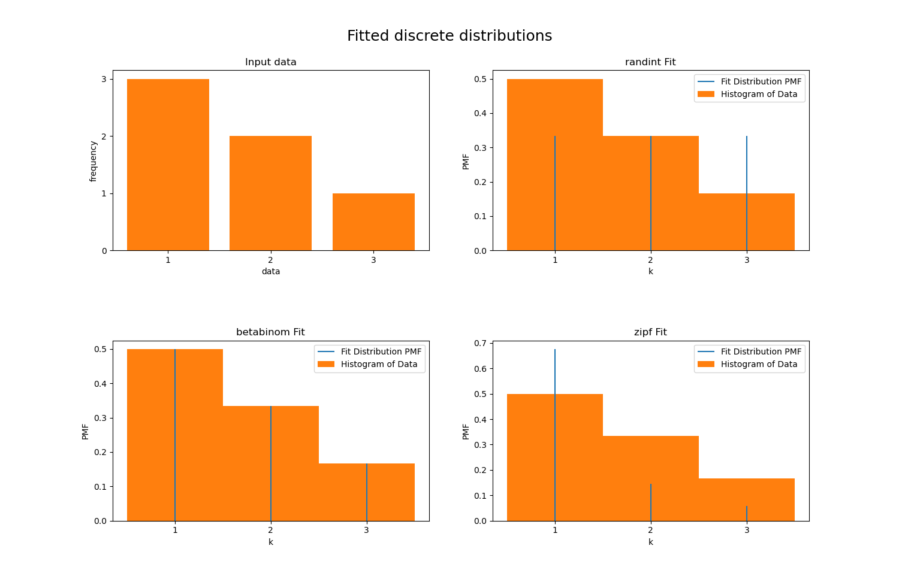

# Fit discrete distributions to a given data set

For a given set of univariate integer data fit a number of discrete distributions and give information about the fits. 
The current distributions used are:
  * [discrete uniform](https://docs.scipy.org/doc/scipy/reference/generated/scipy.stats.randint.html#scipy.stats.randint) (not really a fit then)
  * [beta binomial](https://docs.scipy.org/doc/scipy/reference/generated/scipy.stats.betabinom.html#scipy.stats.betabinom)
  * [zipfian](https://docs.scipy.org/doc/scipy/reference/generated/scipy.stats.zipfian.html#scipy.stats.zipfian)

as implemented by `scipy`

## Requirements
* scipy 1.9.0

## Usage
    > python fit_discrete.py test_data.txt
    
    Successfully fitted the discrete uniform distribution:
      the fit parameters are: FitParams(low=1.0, high=4.0, loc=0.0)
      the negative log likelihood is: 6.591673732008659 

    Successfully fitted the beta binomial distribution:
      the fit parameters are: FitParams(n=2.0, a=0.9999990554067835, b=1.9999982152999867, loc=1.0)
      the negative log likelihood is: 6.068425588244196 

    Successfully fitted the zipfian distribution:
      the fit parameters are: FitParams(a=2.2195448757323435, loc=0.0)
      the negative log likelihood is: 7.86098064513523 
    
    

## Notes
The goodness of fit is determined here using the maximum likehood approach. The fit itself is done by [`scipy.stats.fit`](https://docs.scipy.org/doc/scipy/reference/generated/scipy.stats.fit.html#scipy.stats.fit) which optimises for the parameters that maximise the likelyhood estimate. Note, `scipy.stats.fit` is a new feature introduced in scipy 1.9.0 that allows seamless fitting both discrete and continuous distributions.

The goodness of fit metric shown here is the negative log of the [Probability Mass Function (PMF)](https://docs.scipy.org/doc/scipy/tutorial/stats/discrete.html?highlight=fit#probability-mass-function-pmf).

## Bounds
Fitting requires some rough information about parameters bounds or a guess value to start from. Here, I hard-coded very rough bounds that could very well fail for a variety of data edge cases. These bounds were tested on datasets sampled from uniform distributions. 

## Future work
The script could easily be extended to fit any other [scipy discrete distribution](https://docs.scipy.org/doc/scipy/tutorial/stats/discrete.html?highlight=maximum%20likelihood#discrete-distributions-in-scipy-stats). If additional distributions are required one would have to manually write the distribution function, and then manually find the parameters that maximise the PMF. 

Ideally the choise of distributions would not be hardcoded and the user could choose based on looking at their data what distributions to try. 
